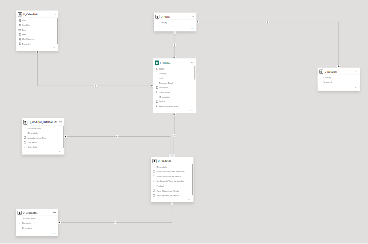

# Desafio Power BI — Modelagem Star Schema e DAX

Projeto desenvolvido como parte do desafio prático de **Power BI da DIO**, com o objetivo de aplicar técnicas de transformação de dados, modelagem dimensional e criação de cálculos utilizando DAX.

A proposta consistiu em transformar a tabela única **Financial Sample** em um modelo dimensional baseado em **Star Schema**, separando os dados em tabela fato e tabelas dimensão.

## Objetivos do Projeto

- Transformar e organizar os dados utilizando Power Query;
- Construir tabelas dimensão a partir da base original;
- Criar a tabela fato `F_Vendas`;
- Criar identificadores para produtos e registros de vendas;
- Desenvolver a dimensão calendário utilizando DAX;
- Configurar os relacionamentos entre as tabelas;
- Criar medidas DAX para validação e análise dos dados;
- Documentar o processo de construção do modelo.

## Estrutura do Modelo

O modelo foi organizado a partir da tabela fato `F_Vendas`, relacionada às dimensões utilizadas para análise.

### Tabela Fato

**F_Vendas**

Tabela central do modelo, contendo informações relacionadas às vendas, como:

- Data;
- País;
- Produto;
- Faixa de desconto;
- Unidades vendidas;
- Vendas brutas;
- Descontos;
- Vendas;
- COGS;
- Lucro;
- Identificador do produto;
- Chave `SK_ID`.

### Tabelas Dimensão

Foram desenvolvidas as seguintes dimensões:

- `D_Produtos` — cadastro dos produtos e indicadores agregados;
- `D_Produtos_Detalhes` — informações complementares dos produtos;
- `D_Descontos` — informações de descontos por produto;
- `D_Detalhes` — informações complementares de país e segmento;
- `D_Paises` — dimensão auxiliar de países;
- `D_Calendário` — dimensão de datas criada utilizando DAX.

A tabela `Financials_origem` foi preservada como backup da base original e ocultada da visualização de relatório.

## Dimensão Calendário

A tabela calendário foi criada em DAX utilizando o intervalo de datas existente na tabela fato:

```DAX
D_Calendário =
CALENDAR(
    MIN(F_Vendas[Date]),
    MAX(F_Vendas[Date])
)
```

Também foram criadas colunas auxiliares para análise temporal, incluindo:

- Ano;
- Número do mês;
- Mês;
- Ano/Mês;
- Trimestre.

## Medidas DAX

Além da modelagem solicitada, foram desenvolvidas medidas para validar o modelo e ampliar as possibilidades de análise:

```DAX
Total Vendas =
SUM('F_Vendas'[Valor Vendas]

Lucro Total =
SUM('F_Vendas'[Profit])

Total Unidades Vendidas =
SUM('F_Vendas'[Units Sold])

Margem de Lucro =
DIVIDE([Lucro Total], [Total Vendas], 0)

Quantidade de Produtos =
DISTINCTCOUNT('F_Vendas'[ID_produto])

Total Descontos =
SUM('F_Vendas'[Discounts])

Ticket Médio =
DIVIDE([Total Vendas], [Total Unidades Vendidas], 0)

Vendas Brutas =
SUM('F_Vendas'[Gross Sales])

Custo Total =
SUM('F_Vendas'[COGS])

Percentual de Desconto =
DIVIDE([Total Descontos], [Vendas Brutas], 0)
```

## Validação dos Resultados

Durante a validação do modelo foram obtidos os seguintes indicadores:

| Indicador | Resultado |
|---|---:|
| Vendas Totais | R$ 118,73 Mi |
| Vendas Brutas | R$ 127,93 Mi |
| Lucro Total | R$ 16,89 Mi |
| Custo Total | R$ 101,83 Mi |
| Descontos | R$ 9,21 Mi |
| Unidades Vendidas | 1,13 Mi |
| Quantidade de Produtos | 6 |
| Ticket Médio | R$ 105,46 |

Os resultados também permitiram verificar a consistência entre vendas brutas, descontos, vendas líquidas, custos e lucro.

## Modelo Dimensional

O modelo foi estruturado com `F_Vendas` como tabela fato central e dimensões responsáveis pelos diferentes contextos de análise.



## Ferramentas e Recursos Utilizados

- Microsoft Power BI Desktop;
- Power Query;
- DAX;
- Modelagem dimensional;
- Star Schema;
- Git e GitHub.

## Aprendizados

Este projeto permitiu aplicar na prática conceitos importantes de Business Intelligence, incluindo transformação de dados, separação entre fatos e dimensões, criação de chaves, relacionamentos, dimensão calendário e desenvolvimento de medidas DAX.

A construção do modelo também reforçou a importância de organizar os dados antes da criação das visualizações, proporcionando uma estrutura mais adequada para análises e manutenção do relatório.

## Arquivos do Projeto

- `desafio-power-bi-modelagem-dax.pbix` — arquivo do projeto Power BI;
- `star-schema-power-bi-modelagem-dax.png` — imagem do modelo dimensional;
- `README.md` — documentação do projeto.

## Autor

**Marcos Roberto**

Projeto desenvolvido para o **Bootcamp DIO — Power BI**.
